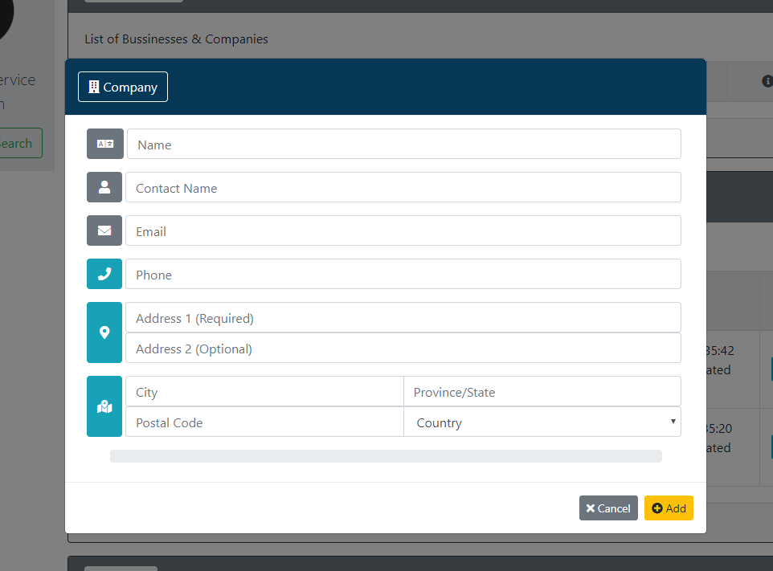
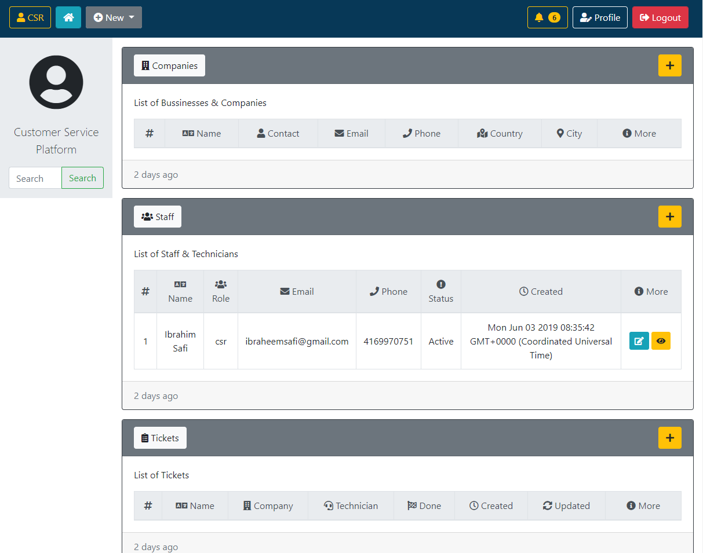

# Customer Service Platform using NodeJS, EJS, and Sequelize

## Overview:
This platform allows companies to manage their customer service by providing a comprehensive view for service providers to manage service tickets, assign technicians, and fulfill customer satisfactions.

## Project Dependencies:
This app requires these node packages: `express`, `express-session`, `bcryptjs`, `connect-flash`, `cookie-parser`, `dotenv`, `ejs`, `mysql2`, `sequelize`.

## The App Features:
* Polished Front-End, Iconic design, and full-responsive (desktop and mobile) layout; by using Bootstrap, FontAwesome, and Embedded-JS frameworks.

* Multi-user privilege levels; supports three user types; `manager`, `Customer Service Representative (CSR)`, `Technician`, as each user possesses a limited system accessibilities.

* Pop-up Modal with interactive design and animated status bar.  see the following screenshot.

## Basic Usage:
* The app runs by navigating into the directory of the app folder, and then type the command `node server.js` in the command line terminal.

* To access the app, open the web-browser and navigate to: "localhost:3000"

* `CSR` or `Manager` user type can add new companies, staff, and tickets.

* `Technician` user can only finish and close the tickets.

## Screenshot of Usage:

* Here's a screenshot of CSR user type dashboard:

## Try it on HEROKU:
This link will jump you to test the application, have fun!
 
  * ["Try it"](https://safe-harbor-19319.herokuapp.com/)